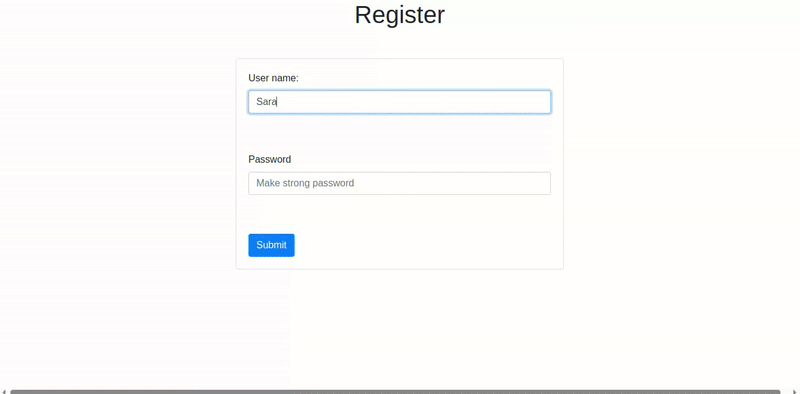

Hi there, this is Python project, with psycopg2 I've build simple social web app, where users can create post, delete and edit their posts, moreover follow and unfollow. It doesn't provide profile edit, tagging and searching. Project is meant to practice postgresql by building the project.

1. Create file, which you will use as virtual environment
2. Install all dependencies, of course postgresql
3. Create DB in that environment and try running config_db.py and connect.py
4. If all works, run schema.py to create all tables for storing data in DB
5. Then you can run main.py and visit localhost to see how it works.

